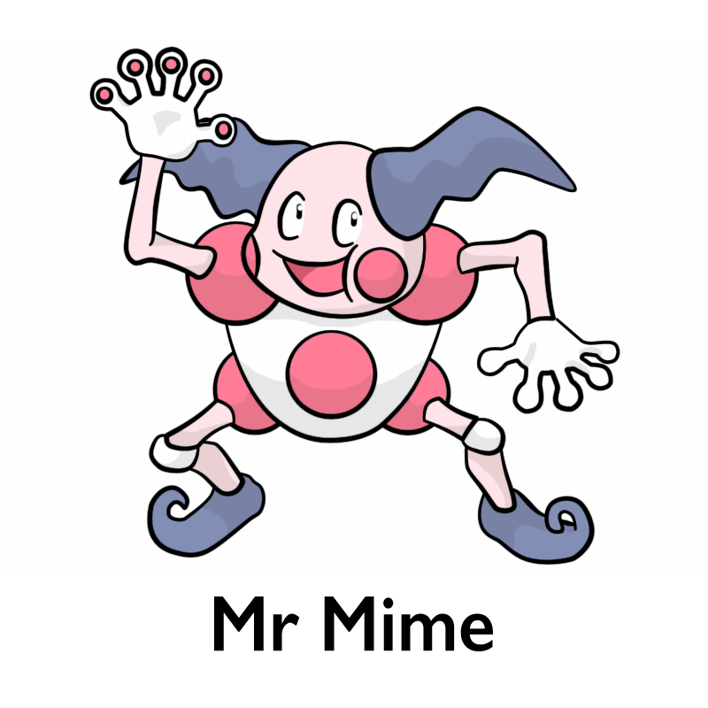

<div align="center">
  
</div>

<div align="center">
  <a href="https://npmjs.org/package/mr.mime">
    
  </a>
  <a href="https://github.com/lukeed/mr.mime/actions">
    
  </a>
  <a href="https://npmjs.org/package/mr.mime">
    
  </a>
  <a href="https://packagephobia.now.sh/result?p=mr.mime">
    
  </a>
</div>

<div align="center">
  A tiny (2.8kB) and fast utility for getting a MIME type from an extension or filename
</div>


## Features

* Lightweight – 2.8kB gzip<br>
  _Only includes standard mime types; all experimental and vendor-specific mimetypes removed._

* Comprehensive Dictionary<br>
  _Generated from [`mime-db`](https://github.com/jshttp/mime-db), which aggregates the IANA, NGINX, and Apache datasets._

* Customizable<br>
  _Exposes the `mimes` dictionary for easy additions or overrides._

* Supports Native ESM<br>
  _Ships with CommonJS and ESM support!_


## Install

```
$ npm install --save mr.mime
```


## Usage

```js
import { lookup, mimes } from 'mr.mime';

// Get a MIME type
// ---
lookup('txt'); //=> "text/plain"
lookup('.txt'); //=> "text/plain"
lookup('a.txt'); //=> "text/plain"

// Unknown extension
// ---
lookup('.xyz'); //=> undefined

// Add extension to dictionary
// ---
mimes['xyz'] = 'hello/world';
lookup('xyz'); //=> "hello/world"
```


## API

### lookup(input)
Returns: `string` or `undefined`

#### input
Type: `string`

The extension or filename to lookup.

> **Important:**
>   * Any `input` value is cast to string, lowercased, and trimmed.
>   * If a filename or filepath is provided, only the extension will be used.


## Credits

Of course, a thank-you to [`mime`](https://github.com/broofa/mime) serving the community all these years & for being a all-encompassing MIME type library. I've only ever needed lookup/`getType` functionality – and now ESM support – so `mr.mime` can only ever support 1/3 of what `mime` offers, at best.

This would not be possible without the team behind [`mime-db`](https://github.com/jshttp/mime-db), who have painstakingly maintained an amazing database for 7+ years.

Artwork created by [mintinol](https://www.deviantart.com/mintinol), which I found [here](https://www.deviantart.com/mintinol/art/Mr-Mime-373927920).


## License

MIT © [Luke Edwards](https://lukeed.com)
